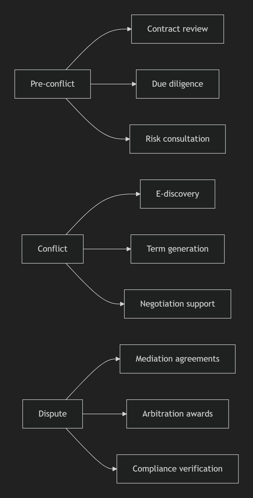

# When Large Language Models Meet Law: Research Framework, Technological Evolution, and Ethical Challenges

## Overview

This repository contains materials for the first comprehensive review of Large Language Models (LLMs) in legal domains, featuring an innovative dual taxonomy integrating legal reasoning frameworks and professional ontologies. The work systematically examines:

- Historical evolution from symbolic AI to transformer-based LLMs
- Technical breakthroughs in context scalability, knowledge integration, and evaluation rigor
- Ethical challenges including hallucination, explainability deficits, and jurisdictional adaptation
- Future research directions for next-generation legal AI systems

```bibtex
@article{shao2025large,
  title={When Large Language Models Meet Law: Research Framework, Technological Evolution, and Ethical Challenges},
  author={Shao, Peizhang and Xu, Linrui and Wang, Jinxi and Zhou, Wei and Wu, Xingyu},
  journal={ACM Computing Surveys},
  volume={37},
  number={4},
  pages={1--35},
  year={2025}
}
```

## Table of Contents

- [Introduction](#introduction)
- [Evolution from Small Models to Large Models](#evolution-from-small-models-to-large-models)
- [LLM-enhanced Legal Reasoning](#llm-enhanced-legal-reasoning)
- [LLMs’ Integrations in Dispute Resolution Procedures](#llms-integrations-in-dispute-resolution-procedures)
- [The Collaboration of Technological Ethics and Legal Ethics](#the-collaboration-of-technological-ethics-and-legal-ethics)
- [Roadmap and Future Directions](#roadmap-and-future-directions)
- [Conclusion](#conclusion)

## Introduction

Innovative dual-lens taxonomy integrating legal reasoning and professional roles:


Core Components:​​

1. ​​Toulmin Argumentation Mapping:​​ Data→Warrant→Backing→Claim computational implementation
2. ​​Professional Role Mapping:​​ Judge/Lawyer/Litigant workflows in litigation/ADR contexts
3. ​​Ethical Co-regulation:​​ Technological ethics × Legal professional responsibilities

## Evolution from Small Models to Large Models

From symbolic systems to transformer-based LLMs in legal NLP:


Evolutionary Stages:​​

​​Period​​  Key Developments​​  Representative Systems​​
Foundations (2017)  Legal embeddings  Law2Vec
Transition (2018-19)  Pretraining paradigms  Legal-BERT
Expansion (2020-21)  Transformer specialization  COLIEE competition frameworks
Breakthrough (2022)  Holistic LLM applications  Lawformer, ChatLaw
Paradigm shift (2023-24)  Lawformer, ChatLaw

## LLM-enhanced Legal Reasoning

Toulmin model implementation for legal task decomposition:


Component-Specific Advancements:​​

### ​​Data Processing

Summarization: ETA abstractive methods
Classification: Hierarchical transformer frameworks
Element ID: RAG-enhanced extraction

### ​​​​Backing Digiting

Case law retrieval: BERT-PLI ensemble models
Statute entailment: Three-stage refinement frameworks

### ​​Warrant Reasoning

Long-text: Sparse attention mechanisms
Low-resource: Few-shot tuning approaches

### ​​Judgment Prediction

Qualified outcomes: Fact-charge decoupling (ADAPT)
Multimodal: GNN-LLM fusion (LLG-Judger)

## LLMs’ Integrations in Dispute Resolution Procedures

### Litigation Workflows

| Role       | LLM Applications                   | Key Benefits                         |
|------------|-------------------------------------|--------------------------------------|
| **Judges** | • Case summarization  • Precedent retrieval | • 40% efficiency gain  • Cross-jurisdictional alignment |
| **Lawyers**| • Contract analysis   • Argument construction | • Ambiguity detection  • Evidence correlation |
| **Litigants**| • Claim articulation  • Knowledge access | • Plain-language explanations  • Rights protection |

### Alternative Dispute Resolution

​​Procedural Framework:​


## The Collaboration of Technological Ethics and Legal Ethics


Dual-Perspective Analysis:​​

​​Technological Ethics:​​
Hallucination mitigation (38% reduction in ChatLaw)
Bias quantification across 12 jurisdictions
Explainability via syllogistic prompting
​​Professional Ethics:​​
Confidentiality protocols: Input redaction standards
Accountability frameworks: Output verification requirements
Competence obligations: Continuous learning imperatives

## Roadmap and Future Directions


Critical research frontiers:

​​Multimodal Integration:​​ Text + Knowledge graphs + Evidence
​​Low-Resource Adaptation:​​ Few-shot tuning for minority jurisdictions
​​Dynamic Rebuttal:​​ Real-time counterargument handling
​​Evaluation Systems:​​ Cross-jurisdictional benchmarks (LawBench)
​​Generative Pretraining:​​ Legal-specific foundation models

## Conclusion

Transformative contributions establishing foundations for legal AI:

- First dual-taxonomy framework integrating Toulmin argumentation with professional roles
- Systematic review of technical evolution from symbolic systems to transformer LLMs
- Scenario-adaptive deployment models for litigation and ADR workflows
- Ethical co-regulation protocols balancing innovation with professional responsibility
- Roadmap addressing critical frontiers in low-resource systems and multimodal integration
