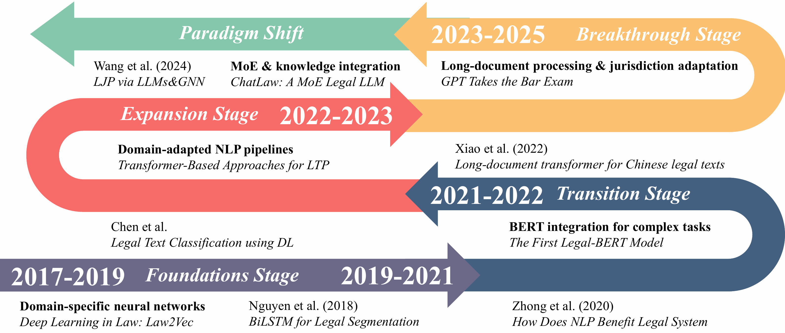

# When Large Language Models Meet Law: Dual-Lens Taxonomy, Technical Advances, and Ethical Governance

## Overview

This repository contains materials for the first comprehensive review of Large Language Models (LLMs) in legal domains, featuring an innovative dual taxonomy integrating legal reasoning frameworks and professional ontologies. The work systematically examines:

- Historical evolution from symbolic AI to transformer-based LLMs
- Technical breakthroughs in context scalability, knowledge integration, and evaluation rigor
- Ethical challenges including hallucination, explainability deficits, and jurisdictional adaptation
- Future research directions for next-generation legal AI systems

```bibtex
@misc{shao2025large,
      title={When Large Language Models Meet Law: Dual-Lens Taxonomy, Technical Advances, and Ethical Governance}, 
      author={Peizhang Shao and Linrui Xu and Jinxi Wang and Wei Zhou and Xingyu Wu},
      year={2025},
      eprint={2507.07748},
      archivePrefix={arXiv},
      primaryClass={cs.CL},
      url={https://arxiv.org/abs/2507.07748}, 
}
```

## Table of Contents

- [Introduction](#introduction)
- [Evolution from Small Models to Large Models](#evolution-from-small-models-to-large-models)
- [LLM-enhanced Legal Reasoning](#llm-enhanced-legal-reasoning)
- [LLMs’ Integrations in Dispute Resolution Procedures](#llms-integrations-in-dispute-resolution-procedures)
- [The Collaboration of Technological Ethics and Legal Ethics](#the-collaboration-of-technological-ethics-and-legal-ethics)

## Introduction

Innovative dual-lens taxonomy integrating legal reasoning and professional roles:


Core Components:​​

1. ​​Toulmin Argumentation Mapping:​​ Data→Warrant→Backing→Claim computational implementation
2. ​​Professional Role Mapping:​​ Judge/Lawyer/Litigant workflows in litigation/ADR contexts
3. ​​Ethical Co-regulation:​​ Technological ethics × Legal professional responsibilities

## Evolution from Small Models to Large Models

From symbolic systems to transformer-based LLMs in legal NLP:



Evolutionary Stages:​​

| Period             | Key                     | Developments                             | Representative Work                   |
|--------------------|-------------------------|------------------------------------------|------------------------------------------|
| Foundations (2017-2019) | Legal embeddings        | Domain-specific neural networks          | [Law2Vec (Chalkidis et al.)](https://link.springer.com/article/10.1007/s10506-018-9238-9),                |
| Transition (2019-2021)| Pretraining paradigms   | BERT integration for complex tasks       | [Legal-BERT (Chalkidis et al.)](https://arxiv.org/pdf/2010.02559)            |
| Expansion (2021-2022) | Transformer specialization | Domain-adapted NLP pipelines             | [Transformer frameworks (Nguyen et al.)](https://link.springer.com/article/10.1007/s12626-022-00102-2)        |
| Breakthrough (2022-2023)| Holistic applications    | Long-document processing & jurisdiction adaptation | [Lawformer (Xiao et al.)](https://www.sciencedirect.com/science/article/pii/S2666651021000176)                  |
| Paradigm shift (2023-2025)| Domain-optimized scaling | Mixture-of-experts & knowledge integration | [LLM-GNN fusion (Wang et al.)](https://pubs.rsc.org/en/content/articlehtml/2024/dd/d4dd00199k) |

## LLM-enhanced Legal Reasoning

Toulmin model implementation for legal task decomposition:


### LLM-assisted Legal Data Processing

| **Category** |      Name                   | **Paper**                                                    | **Venue** | **Year** | **Code**                                               |
| -------- | --------------------- | ------------------------------------------------------------ | --------- | -------- | ------------------------------------------------------------ |
| Word Embedding         | Devlin et al. | [BERT: Pre-training of deep bidirectional transformers for language understanding](https://aclanthology.org/N19-1423.pdf)                 |NAACL      |2019      | https://github.com/google-research/bert     |
| Word Embedding         | Mikolov       | [Efficient estimation of word representations in vector space](https://www.khoury.northeastern.edu/home/vip/teach/DMcourse/4_TF_supervised/notes_slides/1301.3781.pdf)                                      |arxiv       |2013      |http://www.fit.vutbr.cz/~imikolov/rnnlm/word-test.v1.txt      |
| Word Embedding         | Pennington et al. | [Glove: Global vectors for word representation](https://aclanthology.org/D14-1162.pdf)                                                     |EMNLP       |2014      |http://nlp.stanford.edu/projects/glove/      |
| Sentence Embedding     | Hill et al.   | [Learning to understand phrases by embedding the dictionary](https://doi.org/10.1162/tacl_a_00080)                                        |Transactions of the Association for Computational Linguistics       |2016      |N/A      |
| Sentence Embedding     | Kiros et al.  | [Skip-thought vectors](https://proceedings.neurips.cc/paper/2015/hash/f442d33fa06832082290ad8544a8da27-Abstract.html)                                                                              |Advances in neural information processing systems       |2015      |https://github.com/ryankiros/skip-thoughts      |
| Coherence Modeling     | Logeswaran et al. | [Sentence ordering and coherence modeling using recurrent neural networks](https://ojs.aaai.org/index.php/AAAI/article/view/11997)                          |AAAI       |2018      |N/A      |
| Summarization          | Benedetto et al. | [Leveraging large language models for abstractive summarization of Italian legal news](https://link.springer.com/article/10.1007/s10506-025-09431-3)              |AI & Law       |2025      |N/A      |
| Summarization          | Deroy et al.  | [Applicability of large language models and generative models for legal case judgement summarization](https://link.springer.com/article/10.1007/s10506-024-09411-z) |AI & Law       |2024      |N/A      |
| Summarization          | Jain et al.   | [Summarization of Lengthy Legal Documents via Abstractive Dataset Building: An Extract-then-Assign Approach](https://www.sciencedirect.com/science/article/pii/S0957417423020730) |Expert Systems with Applications       |2024      |N/A      |
| Summarization          | Liu et al.    | [Low-resource court judgment summarization for common law systems](https://www.sciencedirect.com/science/article/pii/S0306457324001511)                                  |Information Processing & Management       |2024      |N/A      |
| Summarization          | Nguyen et al. | [Robust deep reinforcement learning for extractive legal summarization](https://link.springer.com/chapter/10.1007/978-3-030-92310-5_69)                             |ICONIP       |2021      |N/A      |
| Summarization          | Pont et al.   | [Legal Summarisation through LLMs: The PRODIGIT Project](https://arxiv.org/pdf/2308.04416)                                            |arxiv       |2023      |N/A      |
| Summarization Evaluation | Elaraby et al. | [Adding Argumentation into Human Evaluation of Long Document Abstractive Summarization: A Case Study on Legal Opinions](https://aclanthology.org/2024.humeval-1.3/) |HumEval       |2024      |N/A      |
| Summarization          | Mao et al.    | [Comparative Analysis of LLM-Generated Event Timeline Summarization for Legal Investigations](https://ieeexplore.ieee.org/abstract/document/10826063/)      |IEEE BigData       |2024      |N/A      |
| Text Processing        | Nguyen et al. | [Transformer-based approaches for legal text processing](https://link.springer.com/article/10.1007/s12626-022-00102-2)                                            |The Review of Socionetwork Strategies       |2021      |N/A      |
| Classification         | Chen et al.   | [A comparative study of automated legal text classification using random forests and deep learning](https://www.sciencedirect.com/science/article/pii/S0306457321002764) |Information Processing & Management       |2022      |https://github.com/unt-iialab/Legal-text-classification      |
| Classification         | Liga et al.   | [Fine-tuning GPT-3 for legal rule classification](https://www.sciencedirect.com/science/article/pii/S0267364923000742)                                                   |Computer Law & Security Review       |2023      |[Dataset Only](https://www.oasis-open.org/committees/tc_home.php?wg_abbrev=legaldocml)      |
| Classification         | Prasad et al. | [Exploring Large Language Models and Hierarchical Frameworks for Classification of Large Unstructured Legal Documents](https://link.springer.com/chapter/10.1007/978-3-031-56060-6_15) |European Conference on Information Retrieval       |2024      |https://github.com/NishchalPrasad/MESc      |
| Argumentation Mining   | Palau et al.  | [Argumentation mining: the detection, classification and structure of arguments in text](https://dl.acm.org/doi/abs/10.1145/1568234.1568246)            |ICAIL       |2009      |N/A      |
| Textual Entailment     | Bilgin et al. | [Exploring Prompting Approaches in Legal Textual Entailment](https://link.springer.com/article/10.1007/s12626-023-00154-y)                                        |The Review Of Socionetwork Strategies       |2024      |N/A      |
| Textual Entailment     | Nguyen et al. | [Employing label models on ChatGPT answers improves legal text entailment performance](https://arxiv.org/abs/2401.17897)               |arxiv       |2024      |N/A      |
| Textual Entailment     | Reji et al.   | [Enhancing LLM Performance on Legal Textual Entailment with Few-Shot CoT-based RAG](https://ieeexplore.ieee.org/abstract/document/10779705)                 |SPICES       |2024      |N/A      |
| Classification         | Santosh et al. | [Zero-shot transfer of article-aware legal outcome classification for european court of human rights cases](https://arxiv.org/abs/2302.00609) |arxiv       |2023      |https://github.com/TUMLegalTech/zeroshotLJP      |
| Prediction             | Liu et al.    | [Augmenting legal judgment prediction with contrastive case relations](https://aclanthology.org/2022.coling-1.235/)                              |International conference on computational linguistics       |      |      |
| Element Recognition    | Yin et al.    | [Mixture of Expert Large Language Model for Legal Case Element Recognition](https://openurl.ebsco.com/EPDB%3Agcd%3A8%3A17264808/detailv2?sid=ebsco%3Aplink%3Ascholar&id=ebsco%3Agcd%3A181743852&crl=c&link_origin=scholar.google.com)                         |ournal of Frontiers of Computer Science & Technology       |2024      |N/A      |
| NER                    | Smadu et al.  | [Legal named entity recognition with multi-task domain adaptation](https://aclanthology.org/2022.nllp-1.29/)                                   |Natural Legal Language Processing Workshop       |2022      |https://github.com/elenanereiss/Legal-Entity-Recognition      |

### LLM-assisted Legal Backing Digiting

| **Category** |      Name                   | **Paper**                                                    | **Venue** | **Year** | **Code**                                               |
| -------- | --------------------- | ------------------------------------------------------------ | --------- | -------- | ------------------------------------------------------------ |
| Retrieval                 | Tran et al.   | [Building legal case retrieval systems with lexical matching and summarization using a pre-trained phrase scoring model](https://dl.acm.org/doi/abs/10.1145/3322640.3326740) |ICAIL       |2019      |N/A      |
| Retrieval                 | Shao et al.   | [BERT-PLI: Modeling paragraph-level interactions for legal case retrieval](https://www.ijcai.org/proceedings/2020/0484.pdf)                         |IJCAI       |2020      |https://github.com/ThuYShao/BERT-PLI-IJCAI2020      |
| Entailment                | Rabelo et al. | [Combining similarity and transformer methods for case law entailment](https://dl.acm.org/doi/abs/10.1145/3322640.3326741)                              |ICAIL       |2019      |N/A      |
| Retrieval                 | Shao et al.   | [BERT-based ensemble model for statute law retrieval and legal information entailment](https://link.springer.com/chapter/10.1007/978-3-030-79942-7_15)              |JSAI       |2020      |N/A      |
| Pre-training              | Su et al.     | [Caseformer:Pre-training for legal case retrieval](https://openreview.net/forum?id=9281rETges)                                                  |CoRR       |2023      |https://github.com/oneal2000/Caseformer      |
| Retrieval                 | Kim et al.    | [Legal information retrieval and entailment based on bm25, transformer and semantic thesaurus methods](https://link.springer.com/article/10.1007/s12626-022-00103-1)       |The Review of Socionetwork Strategies      |2022      |N/A      |
| Retrieval                 | Nguyen et al. | [Attentive deep neural networks for legal document retrieval](https://link.springer.com/article/10.1007/s10506-022-09341-8)                                       |AI & Law       |2024      |N/A      |
| Retrieval                 | Yoshioka et al. | [Hukb at the coliee 2022 statute law task](https://link.springer.com/chapter/10.1007/978-3-031-29168-5_8)                                                          |JSAI       |2022      |N/A      |
| Entailment                | Wehnert et al. | [Applying BERT embeddings to predict legal textual entailment](https://link.springer.com/article/10.1007/s12626-022-00101-3)                                      |The Review of Socionetwork Strategies       |2022      |[Model Only](https://huggingface.co/nlpaueb/legal-bert-base-uncased)      |
| Information Extraction    | Hudek et al.  | [Information extraction/entailment of common law and civil code](https://link.springer.com/chapter/10.1007/978-3-030-79942-7_17)                                   |JSAI       |2020      |N/A      |
| Pre-training Evaluation  | Zheng et al.  | [When does pretraining help? assessing self-supervised learning for law and the casehold dataset](https://dl.acm.org/doi/abs/10.1145/3462757.3466088)    |ICAIL       |2021      |N/A      |
| Retrieval Framework       | Nguyen et al. | [Retrieve-Revise-Refine: A novel framework for retrieval of concise entailing legal article set](https://www.sciencedirect.com/science/article/pii/S030645732400308X)   |Information Processing & Management       |2025      |N/A      |
| Retrieval                 | Nguyen et al. | [Pushing the boundaries of legal information processing with integration of large language models](https://link.springer.com/chapter/10.1007/978-981-97-3076-6_12)   |JSAI       |2024      |N/A      |
| Correspondence Modeling   | Ge et al.     | [Learning fine-grained fact-article correspondence in legal cases](https://ieeexplore.ieee.org/abstract/document/9627791)                                  |IEEE/ACM Transactions on Audio, Speech, and Language Processing       |2021      |https://github.com/gjdnju/MLMN      |
| Relevance Comprehension  | Li et al.     | [Towards an In-Depth Comprehension of Case Relevance for Better Legal Retrieval](https://link.springer.com/chapter/10.1007/978-981-97-3076-6_15)                  |JSAI       |2024      |N/A      |
| Health Information Retrieval | Milanese et al. | [Fact-Driven Health Information Retrieval: Integrating LLMs and Knowledge Graphs to Combat Misinformation](https://link.springer.com/chapter/10.1007/978-3-031-88714-7_17) |European Conference on Information Retrieval       |2025      |https://github.com/ikr3-lab/fact-driven-health-ir/      |
| Bias Analysis             | Cuconasu et al. | [Do RAG Systems Suffer From Positional Bias?](https://arxiv.org/pdf/2505.15561)                                                       |arxiv       |2025      |N/A      |
| Uncertainty Calibration   | Shi et al.    | [Ambiguity detection and uncertainty calibration for question answering with large language models](https://aclanthology.org/2025.trustnlp-main.4/) |TrustNLP       |2025      |N/A      |
| Relevance Judgment       | Shao et al.   | [Understanding relevance judgments in legal case retrieval](https://dl.acm.org/doi/full/10.1145/3569929)                                         |ACM Transactions on Information Systems       |2023      |N/A      |
| Graph-based Retrieval     | Tang et al.   | [CaseGNN: Graph Neural Networks for Legal Case Retrieval with Text-Attributed Graphs](https://link.springer.com/chapter/10.1007/978-3-031-56060-6_6)                |European Conference on Information Retrieval       |2024      |https://github.com/yanran-tang/CaseGNN      |
| Provision Selection       | Wang et al.   | [Causality-inspired legal provision selection with large language model-based explanation](https://link.springer.com/article/10.1007/s10506-024-09429-3)           |AI & Law       |2024      |N/A      |
| Data Augmentation         | Bui et al.    | [Data Augmentation and Large Language Model for Legal Case Retrieval and Entailment](https://link.springer.com/article/10.1007/s12626-024-00158-2)                |The Review of Socionetwork Strategies       |2024      |N/A      |
| Legal Information Processing | Nguyen et al. | [NOWJ@ COLIEE 2024: leveraging advanced deep learning techniques for efficient and effective legal information processing](https://link.springer.com/chapter/10.1007/978-981-97-3076-6_13) |JSAI       |2024      |N/A      |
| Ensemble Approaches       | Vuong et al.  | [NOWJ at COLIEE 2023: Multi-task and Ensemble Approaches in Legal Information Processing](https://link.springer.com/article/10.1007/s12626-024-00157-3)           |The Review of Socionetwork Strategies       |2024      |N/A      |
| Legal Entity Analysis      | Onaga et al.  | [Contribution Analysis of Large Language Models and Data Augmentations for Person Names in Solving Legal Bar Examination at COLIEE 2023](https://link.springer.com/article/10.1007/s12626-024-00155-5) |The Review of Socionetwork Strategies       |2024      |N/A      |
| CoT Tuning                | Fujita et al. | [LLM Tuning and Interpretable CoT: KIS Team in COLIEE 2024](https://link.springer.com/chapter/10.1007/978-981-97-3076-6_10)                                        |JSAI       |2024      |N/A      |

### LLM-assisted Legal Warrant Reasoning Generation

| **Category** |      Name                   | **Paper**                                                    | **Venue** | **Year** | **Code**                                               |
| -------- | --------------------- | ------------------------------------------------------------ | --------- | -------- | ------------------------------------------------------------ |
| Long-text Processor       | Xiao et al.   | [Lawformer: A pre-trained language model for chinese legal long documents](https://www.sciencedirect.com/science/article/pii/S2666651021000176)                          |AI Open       |2021      |https://github.com/thunlp/LegalPLMs      |
| Legal QA System           | Huang et al.  | [Lawyer llama technical report](https://arxiv.org/pdf/2305.15062)                                                                     |arxiv       |2023      |https://github.com/AndrewZhe/lawyer-llama      |
| Reasoning Framework       | Yue et al.    | [Disc-lawllm: Fine-tuning large language models for intelligent legal services](https://arxiv.org/pdf/2309.11325)                     |arxiv       |2023      |https://github.com/FudanDISC/DISC-LawLLM      |
| Benchmark                 | Fei et al.    | [Lawbench: Benchmarking legal knowledge of large language models](https://arxiv.org/pdf/2309.16289)                                    |arxiv       |2023      |https://github.com/open-compass/LawBench/      |
| Benchmark                 | Guha et al.   | [Legalbench: A collaboratively built benchmark for measuring legal reasoning in large language models](https://proceedings.neurips.cc/paper_files/paper/2023/hash/89e44582fd28ddfea1ea4dcb0ebbf4b0-Abstract-Datasets_and_Benchmarks.html) |Advances in Neural Information Processing Systems       |2023      |https://github.com/HazyResearch/legalbench      |
| MoE Architecture          | Cui et al.    | [Chatlaw: A multi-agent collaborative legal assistant with knowledge graph enhanced mixture-of-experts large language model](https://arxiv.org/pdf/2306.16092) |arxiv       |2024      |https://github.com/PKU-YuanGroup/ChatLaw      |
| Precedent Retrieval       | Wiratunga et al. | [CBR-RAG: case-based reasoning for retrieval augmented generation in LLMs for legal question answering](https://link.springer.com/chapter/10.1007/978-3-031-63646-2_29) |International Conference on Case-Based Reasoning       |2024      |https://github.com/rgu-iit-bt/cbr-for-legal-rag      |
| Domain-specific LLM       | Fei et al.    | [Internlm-law: An open source chinese legal large language model](https://arxiv.org/pdf/2406.14887)                                   |arxiv       |2024      |https://github.com/InternLM/InternLM-Law      |
| Text Analytics            | Ghosh et al.  | [Human Centered AI for Indian Legal Text Analytics](https://arxiv.org/pdf/2403.10944)                                                |arxiv       |2024      |N/A      |
| Hallucination Analysis    | Dahl et al.   | [Large legal fictions: Profiling legal hallucinations in large language models](https://academic.oup.com/jla/article/16/1/64/7699227)                      |Journal of Legal Analysis       |2024      |N/A      |
| Factor Annotation         | Gray et al.   | [Empirical legal analysis simplified: reducing complexity through automatic identification and evaluation of legally relevant factors](https://royalsocietypublishing.org/doi/abs/10.1098/rsta.2023.0155) |Philosophical Transactions of the Royal Society A       |2024      |N/A      |
| Legal Support             | Maree et al.  | [Transforming legal text interactions: leveraging natural language processing and large language models for legal support in Palestinian cooperatives](https://link.springer.com/article/10.1007/s41870-023-01584-1) |International Journal of Information Technology       |2024      |N/A      |
| Reasoning                | Deng et al.   | [Syllogistic reasoning for legal judgment analysis](https://aclanthology.org/2023.emnlp-main.864/)                                                 |Conference on Empirical Methods in Natural Language Processing       |2023      |[N/A]https://github.com/%20dengwentao99/SLJA)      |

### LLM-assisted Legal Judgment Prediction with Qualifiers

| **Category** |      Name                   | **Paper**                                                    | **Venue** | **Year** | **Code**                                               |
| -------- | --------------------- | ------------------------------------------------------------ | --------- | -------- | ------------------------------------------------------------ |
| Prediction                | Strickson et al. | [Legal judgement prediction for UK courts](https://dl.acm.org/doi/abs/10.1145/3388176.3388183)                                                          |ICISS       |2020      |N/A      |
| Representation Learning  | Ma et al.     | [Judgment Prediction Based on Case Life Cycle](https://legalai2020.github.io/file/LuYaoMa.pdf)                                                     |International Workshop on Legal Intelligence & SIGIR       |2020      |N/A      |
| Representation Learning  | Ma et al.     | [Legal judgment prediction with multi-stage case representation learning in the real court setting](https://dl.acm.org/doi/abs/10.1145/3404835.3462945) |SIGIR       |2021      |https://github.com/mly-nlp/LJP-MSJudge      |
| Judgement Prediction      | Prasad et al. | [IRIT_IRIS_C at SemEval-2023 Task 6: A Multi-level Encoder-based Architecture for Judgement Prediction of Legal Cases and their Explanation](https://hal.science/hal-04729016/) |SemEval       |2023      |https://github.com/NishchalPrasad/SemEval-2023-Task-6-sub-task-C-      |
| Element Extraction        | Lyu et al.    | [Improving legal judgment prediction through reinforced criminal element extraction](https://www.sciencedirect.com/science/article/pii/S0306457321002600)                |Information Processing & Management       |2022      |https://github.com/lvyougang/CEEN/      |
| Dependency Learning       | Huang et al.  | [Dependency learning for legal judgment prediction with a unified text-to-text transformer](https://arxiv.org/pdf/2112.06370)          |arxiv       |2021      |N/A      |
| Multi-task Prediction     | Xu et al.     | [Multi-task legal judgement prediction combining a subtask of the seriousness of charges](https://link.springer.com/chapter/10.1007/978-3-030-63031-7_30)          |CCL       |2020      |N/A      |
| Event Extraction          | Feng et al.   | [Legal judgment prediction via event extraction with constraints](https://aclanthology.org/2022.acl-long.48/)                                  |Annual Meeting of the Association for Computational Linguistics       |2022      |https://github.com/WAPAY/EPM      |
| Contrastive Learning      | Liu et al.    | [Augmenting legal judgment prediction with contrastive case relations](https://aclanthology.org/2022.coling-1.235/)                             |International Conference on Computational Linguistics       |2022      |https://github.com/dgliu/COLING22_CTM      |
| Contrastive Learning      | Zhang et al.  | [Contrastive learning for legal judgment prediction](https://dl.acm.org/doi/full/10.1145/3580489)                                                |ACM Transactions on Information Systems       |2023      |N/A      |
| Knowledge Injection       | Gan et al.    | [Judgment prediction via injecting legal knowledge into neural networks](https://ojs.aaai.org/index.php/AAAI/article/view/17522)                            |AAAI Conference on Artificial Intelligence       |2021      |https://github.com/Yyy11181/LLMs-based-Neuro-Symbolic-Framework-for-DWI-cases      |
| Benchmark                 | Chalkidis et al. | [LexGLUE: A benchmark dataset for legal language understanding in English](https://arxiv.org/pdf/2110.00976)                          |arxiv       |2021      |https://github.com/coastalcph/lex-glue      |
| Benchmark                 | Niklaus et al. | [Swiss-judgment-prediction: A multilingual legal judgment prediction benchmark](https://arxiv.org/pdf/2110.00806)                     |arxiv       |2021      |https://zenodo.org/records/5529712      |
| Benchmark                 | Hwang et al.  | [A multi-task benchmark for korean legal language understanding and judgement prediction](https://proceedings.neurips.cc/paper_files/paper/2022/hash/d15abd14d5894eebd185b756541d420e-Abstract-Datasets_and_Benchmarks.html)           |Advances in Neural Information Processing Systems       |2022      |https://huggingface.co/datasets/lbox/lbox_open      |
| Statute Prediction        | Vats et al.   | [Llms-the good, the bad or the indispensable?: A use case on legal statute prediction and legal judgment prediction on indian court cases](https://aclanthology.org/2023.findings-emnlp.831/) |EMNLP       |2023      |https://github.com/somsubhra04/LLM_Legal_Prompt_Generation      |
| Evaluation                | Shui et al.   | [A comprehensive evaluation of large language models on legal judgment prediction](https://arxiv.org/pdf/2310.11761)                 |arxiv       |2023      |https://github.com/srhthu/LM-CompEval-Legal      |
| Realistic Prediction      | Nigam et al.  | [Rethinking legal judgement prediction in a realistic scenario in the era of large language models](https://arxiv.org/pdf/2410.10542) |arxiv       |2024      |https://github.com/ShubhamKumarNigam/Realistic_LJP      |
| Reasoning                | Deng et al.   | [Enabling discriminative reasoning in llms for legal judgment prediction](https://arxiv.org/pdf/2407.01964)                           |arxiv       |2024      |N/A      |
| Graph Learning            | Yangbin et al. | [Legal Judgment Prediction with LLM and Graph Contrastive Learning Networks](https://dl.acm.org/doi/full/10.1145/3709026.3709068)                         |International Conference on Computer Science and Artificial Intelligence       |2024      |[Dataset Only1](https://huggingface.co/datasets/coastalcph/fairlex/viewer/ecthr), [Dataset Only2](https://huggingface.co/datasets/AUEB-NLP/ecthr_cases)      |
| Rule-enhanced Prediction  | Zhang et al.  | [RLJP: Legal Judgment Prediction via First-Order Logic Rule-enhanced with Large Language Models](https://arxiv.org/pdf/2505.21281)    |arxiv       |2025      |https://anonymous.4open.science/r/RLJP-FDF1      |
| Neuro-symbolic Framework  | Wei et al.    | [An LLMs-based neuro-symbolic legal judgment prediction framework for civil cases](https://link.springer.com/article/10.1007/s10506-025-09433-1)                 |AI & Law       |2025      |N/A      |
| Framework                 | Wang et al.   | [LegalReasoner: A Multi-Stage Framework for Legal Judgment Prediction via Large Language Models and Knowledge Integration](https://ieeexplore.ieee.org/abstract/document/10750819) |IEEE Access       |2024      |[Model Only](https://huggingface.co/nsi319/legal-pegasus)      |
| Survey                    | Cui et al.    | [A survey on legal judgment prediction: Datasets, metrics, models and challenges](https://ieeexplore.ieee.org/abstract/document/10255647)                   |IEEE Access       |2023      |N/A      |
| Survey                    | Medvedeva et al. | [Rethinking the field of automatic prediction of court decisions ](https://link.springer.com/article/10.1007/s10506-021-09306-3)                                 |AI & Law       |2023      |N/A      |

## LLMs’ Integrations in Dispute Resolution Procedures

Note: Only the paper never cited before this part are shown below:

### Litigation Workflows

| Category          | Name          | Paper                                                                                              | Venue | Year | Code |
|-------------------|---------------|---------------------------------------------------------------------------------------------------|-------|------|------|
| COLIEE Competition          | Goebel et al. | [Overview and Discussion of the Competition on Legal Information, Extraction/Entailment(COLIEE) 2023](https://link.springer.com/article/10.1007/s12626-023-00152-0) |The Review of Socionetwork Strategies       |2024      |N/A      |                                                                               |       |      |      |
| Information Retrieval | Nguyen et al. | [Pushing the boundaries of legal information processing with integration of large language models](https://link.springer.com/chapter/10.1007/978-981-97-3076-6_12)   |JSAI       |2024      |N/A      |
| Litigation Support    | Siino et al.    | [Exploring LLMs Applications in Law: A Literature Review on Current Legal NLP Approaches](https://ieeexplore.ieee.org/abstract/document/10850911)             |IEEE Access       |2025      |N/A      |
| Hierarchical Classification | Prasad et al.   | [Exploring Large Language Models and Hierarchical Frameworks for Classification of Large Unstructured Legal Documents](https://link.springer.com/chapter/10.1007/978-3-031-56060-6_15) |European Conference on Information Retrieval       |2024      |N/A      |

### Alternative Dispute Resolution

| Category               | Name            | Paper                                                                                              | Venue | Year | Code |
|------------------------|-----------------|---------------------------------------------------------------------------------------------------|-------|------|------|
| Contract Review        | Hendrycks et al. | [CUAD: an expert-annotated NLP dataset for legal contract review](https://arxiv.org/abs/2103.06268)                                  |arxiv       |2021      |https://github.com/TheAtticusProject/cuad/      |
| Contract System        | Zeng et al.      | [Contract-Mind: Trust-calibration interaction design for AI contract review tools](https://www.sciencedirect.com/science/article/pii/S1071581924001940)                  |International Journal of Human-Computer Studies       |2025      |N/A      |
| NLP for Contracts      | Graham et al.    | [Natural language processing for legal document review: categorising deontic modalities in contracts](https://link.springer.com/article/10.1007/s10506-023-09379-2) |AI & Law       |2023      |N/A      |
| Financial Analysis     | Bedekar et al.   | [AI in Mergers and Acquisitions: Analyzing the Effectiveness of Artificial Intelligence in Due Diligence](https://ieeexplore.ieee.org/abstract/document/10616599) |ICKECS       |2024      |N/A      |
| Contract Automation    | Mik              | [Much ado about artificial intelligence or: the automation of contract formation](https://academic.oup.com/ijlit/article-abstract/30/4/484/7092982)                 | International Journal of Law and Information Technology       |2022      |N/A      |
| eDiscovery             | Pai et al.       | [Exploration of open large language models for ediscovery](https://aclanthology.org/2023.nllp-1.17/)                                         |Natural Legal Language Processing Workshop       |2023      |N/A      |
| Blockchain             | Stjepanovic et al.         |  [Leveraging artificial intelligence in ediscovery: enhancing efficiency, accuracy, and ethical considerations](https://heinonline.org/HOL/LandingPage?handle=hein.journals/rgllr2024&div=18&id=&page=)      |Regional L. Rev.       |2024      |N/A      |
| Mediation Agreement    | Goswami et al.   | [Incorporating Domain Knowledge in Multi-objective Optimization Framework for Automating Indian Legal Case Summarization](https://link.springer.com/chapter/10.1007/978-3-031-78495-8_17) |International Conference on Pattern Recognition       |2024      |N/A      |
| Text Analytics         | Ghosh et al.     | [Human Centered AI for Indian Legal Text Analytics](https://arxiv.org/pdf/2403.10944)                                                |arxiv       |2024      |N/A      |

## The Collaboration of Technological Ethics and Legal Ethics


